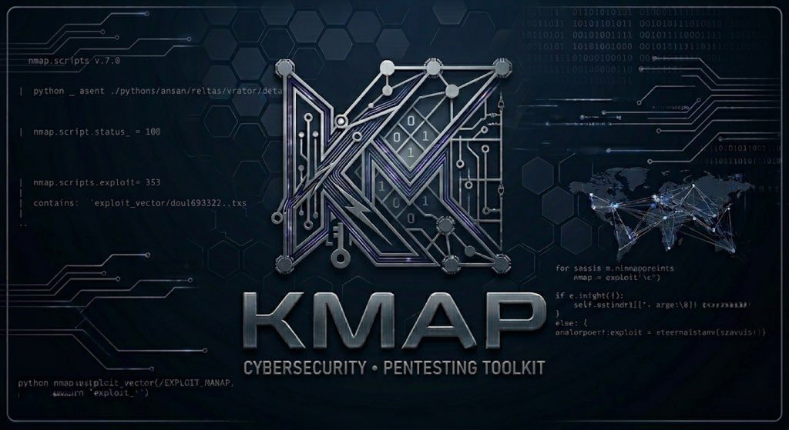

<p align="center">
  
</p>

# Kmap

**Kmap** is a fork of [nmap](https://nmap.org/) extended into a self-contained internet-scale reconnaissance and attack-surface platform. It keeps everything nmap does — port scanning, service detection, OS fingerprinting, NSE scripts — and adds a full discover → enrich → store → query pipeline that sweeps the public IPv4 space with a stateless raw-SYN engine, fingerprints what it finds (TLS, SSH HASSH, favicon, HTTP), cross-references versions against a bundled CVE database enriched with EPSS exploit-probability and CISA KEV flags, and persists everything to a sharded SQLite store you can search, tag, and pivot across — the kind of capability otherwise found only behind commercial services like Shodan and Censys. It also keeps the per-host offensive tooling for security assessments: default-credential probing, HTTP/S recon, and screenshots.

> **License:** Kmap inherits the Nmap Public Source License (NPSL). See `LICENSE` for full terms.

> **Query what you collected.** After a scan, `--net-query` searches the persisted store by port, service, CVE, CVSS, EPSS, CISA-KEV, ASN, country, web fingerprint, device class, or derived tag (`self-signed`, `cloud`, `eol-product`, …) — no re-scan needed. See [`docs/querying.md`](docs/querying.md) for the full filter reference and examples.

---

## Documentation

All guides render on GitHub under [`docs/`](docs/):

| Guide | What it covers |
|-------|----------------|
| [Internet-scale scanning](docs/internet-scale-scanning.md) | The core `--net-scan` workflow end-to-end: discover → enrich → report, single-port vs multi-port, `--rate`, sampling (`--net-max-ips`), resuming, phase splitting, excludes, 32-shard layout, and watchlist monitoring |
| [Performance & resource tuning](docs/performance.md) | `--fast` / `--efficient` modes, the CPU governor, discovery/enrichment concurrency, the full environment-variable reference, and gaming-PC tuning recipes |
| [Performance roadmap](docs/performance-roadmap.md) | Where throughput is bound today and the ranked backlog of changes that would lift it (async connect engine, screenshot pool, prepared-statement DB writes, …) |
| [Async discovery engine (design)](docs/async-discovery-design.md) | Implementation-ready design for the nsock-based async connect engine — the ~100× discovery lever |
| [Asset-intelligence (design)](docs/asset-intelligence-design.md) | Design for the remaining online enrichment legs — cert Org/CT/subdomains, WHOIS/RDAP, passive DNS — on a shared verifying-HTTPS client |
| [Querying collected data](docs/querying.md) | `--net-query` filters (port, service, CVE, CVSS, ASN, country, web title/server, device class) and output formats |
| [Pivoting & topology](docs/pivoting-and-topology.md) | `--net-cluster` (correlate hosts by shared TLS/host fingerprints), `--tracemap` / `--topo-export` (path & ASN topology graphs), and `--spoof-os` (OS/browser personality for enrichment) |
| [Reading the findings report](docs/findings-report.md) | The `Findings/findings_NNN.txt` layout: file naming/ordering, the PORT TABLE / CVE MAP (`[REMOTE]` tags) / PATCH STATUS / WEB RECON sections, the file summary, and grep recipes |
| [Data model](docs/data-model.md) | On-disk storage: 32-shard SQLite layout, the `hosts`/`fingerprints` schema, rescan/history semantics, and direct `sqlite3` queries |
| [Troubleshooting](docs/troubleshooting.md) | Fixes for the common issues: slow scans, missing CVEs/ASN, resume failures, the Windows Npcap warning, and where results land |
| [ypanel integration](docs/ypanel.md) | Driving Kmap remotely from the ypanel operator control plane |

The full nmap-derived manual lives in [`docs/kmap.1`](docs/kmap.1) (`man kmap`).

---

## Background

### The NSA and Mapping the Internet

In 2014, documents leaked by Edward Snowden revealed that the NSA and its Five Eyes partners had built classified programs to map and catalog the entire internet:

- **TREASUREMAP** — An NSA program designed to build a near-real-time interactive map of every device on the global internet. The goal was to visualize the full network topology: routers, servers, endpoints, and the connections between them. Published by Der Spiegel, the leaked slides described it as mapping "any device, anywhere, all the time."

- **HACIENDA** — A GCHQ (UK signals intelligence) program that performed port scanning of entire countries' IP address spaces. It systematically probed every public IP in targeted nations to identify open services, vulnerable software, and potential entry points. Essentially, it was nmap at nation-state scale.

- **Equation Group** — Identified by Kaspersky Lab in 2015 and widely attributed to the NSA's Tailored Access Operations (TAO) unit, the Equation Group used the intelligence gathered by programs like TREASUREMAP and HACIENDA to deploy some of the most sophisticated cyber operations ever discovered. Their toolkit — later leaked by the Shadow Brokers in 2016–2017 — included exploits like EternalBlue, which went on to power the WannaCry ransomware outbreak.

The pipeline was: **scan everything** (HACIENDA) → **map it** (TREASUREMAP) → **exploit it** (Equation Group tools).

### Commercial Internet Mapping Today

What the NSA did in secret, several companies now do openly and commercially:

- **[Shodan](https://www.shodan.io/)** — The original "search engine for the internet of things." Continuously scans the entire IPv4 space and indexes banners, services, and device metadata. Founded in 2009.
- **[Censys](https://censys.io/)** — Built by researchers at the University of Michigan using their ZMap scanner. Performs daily internet-wide scans and provides a searchable database of hosts, certificates, and services.
- **[Rapid7 Project Sonar](https://www.rapid7.com/research/project-sonar/)** — An open research project that conducts internet-wide surveys across multiple protocols (HTTP, HTTPS, DNS, SSH, etc.) and publishes the datasets publicly.
- **[Shadowserver Foundation](https://www.shadowserver.org/)** — A nonprofit that scans the internet to identify vulnerable and compromised systems, providing free daily reports to network operators worldwide.
- **[BinaryEdge](https://www.binaryedge.io/)** — Real-time internet scanning platform focused on attack surface monitoring and vulnerability detection.

These platforms prove that internet-wide scanning of public-facing services is a legitimate, legal, and valuable practice for security research, vulnerability management, and threat intelligence.

### Where Kmap Fits

Kmap brings internet-scale scanning capability to individual security researchers and small teams — without relying on third-party APIs or paid subscriptions. Its `--net-scan` pipeline can discover, fingerprint, and catalog services across the entire public IPv4 address space (~3.7 billion addresses), then enrich the results with CVE cross-referencing and web reconnaissance. For teams managing client infrastructure, the `--watchlist` mode provides continuous monitoring with change detection.

Everything runs from a single `kmap` binary with no external dependencies — no Python scripts, no separate database servers, no masscan installation. Just Kmap and its bundled SQLite.

---

## What's New Over nmap

| Feature | Flag | What it does |
|---|---|---|
| Default credential probing | `--default-creds` | Tests open services against 280+ built-in credential pairs |
| HTTP/S recon | `--web-recon` | Grabs titles, headers, TLS info, probes 180+ high-value paths |
| CVE cross-reference | `--cve-map` | Queries bundled 10,100+ CVE database for detected service versions |
| Scan report | `--report <file>` | Generates a styled `.txt` or `.md` report with all findings |
| Web screenshots | `--screenshot` | Captures PNG screenshots of discovered web ports |
| Internet-scale scanning | `--net-scan` | Full pipeline: discover, enrich, and report across the entire IPv4 space |
| ASN/GeoIP enrichment | (automatic) | Resolves every IP to its ASN, owner, country via Team Cymru DNS |
| SSH HASSH fingerprint | (automatic) | Hashes each SSH server's `KEXINIT` algorithm lists into a HASSH (Shodan `ssh.hasshserver`); a `--net-cluster` pivot that survives banner spoofing |
| Watchlist monitoring | `--watchlist <file>` | Re-scan owned/client assets and detect changes |
| Data query | `--net-query` | Search collected scan data by port, service, CVE, CVSS, ASN, country |
| Full-text search | `--search <query>` | FTS5 free-text + faceted search over the catalog (e.g. `service:nginx country:US cloudflare`, boolean/phrase) |
| Entity graph | `--entity-graph <ip>` | Asset-attribution graph IP→Domain→Cert→Org→ASN→Country (+ cohort), as text/dot/json |
| Network topology mapping | `--tracemap <targets>` | Maps network paths, detects gateways, ASN boundaries, hub routers |
| Resource-aware speed modes | `--efficient` / `--fast` | Auto-scale worker pools to the machine's CPU/RAM; `--fast` is capped at a tunable share (default ~50% CPU / ~25% RAM) |

All per-host features auto-enable `-sV` (service/version detection) and print results inline alongside the normal port table.

---

## Benchmarks

Kmap discovers with one of two engines. When raw packets are available
(root/admin and an Npcap/libpcap capture device) it runs a stateless **raw-SYN
engine** — a TX thread blasts cookie-stamped SYNs while a separate RX thread
validates the SYN-ACKs, carrying zero per-probe state (masscan/zmap style: the
SYN cookie lives in the TCP sequence number). Otherwise it falls back to a
**`connect()` sweep** bounded by how many sockets are in flight. Both feed the
same enrichment pipeline. The send rate is unlimited by default; pass
`--rate <pps>` to throttle.

Each figure is tagged by how it was obtained — **[M]** measured on a real run,
**[D]** derived from a source constant (a ceiling the code cannot exceed), or
**[Y]** run-it-yourself (depends on your link and targets). Measured numbers are
from **Windows 11, Ryzen 5 5600X (6C/12T), 32 GB, Npcap 1.88**, scanning **real
internet hosts** — no synthetic ranges, no loopback. The binary is the 32-bit
MSVC build; component micro-benchmarks are MinGW g++ `-O2` linking the real Kmap
`.cc`. Reproduce with [`bench/`](bench/); Linux behaviour is verified in CI
([`fuzz.yml`](.github/workflows/fuzz.yml)).

### Raw-SYN engine

The SYN frame is built once as a 54-byte **template**, then per probe only the
dst IP, dst port and SYN cookie are patched in with an **incremental (RFC 1624)
checksum** — no per-packet rebuild, malloc or full re-sum. Frames transmit
**batched** (one Npcap `pcap_sendqueue` per batch on Windows, a tight `send` loop
on POSIX), optionally **sharded across N send handles**
(`KMAP_RAWSYN_TX_THREADS`). The RX captures the burst with `pcap_dispatch` and
only **buffers opens in memory**; the whole result set is **flushed to the shard
DBs after the sweep** (one prepared UPSERT reused per shard), so discovery never
blocks on SQLite and enrichment runs unchanged over the same shards.

Sustained discovery on a random internet sample (real IPs, `--discover-only`,
unlimited rate):

| Engine | Throughput | vs `connect()` | |
|---|---|---|:--:|
| raw-SYN, 2 send threads | **~38,000 IPs/sec** (500k sample, 13 s) | — | [M] |
| raw-SYN, 1 send thread | ~28,000 IPs/sec (500k, 18 s) | — | [M] |
| `connect()`, 300 workers | 735 IPs/sec (50k, 68 s) | raw **~52x faster** | [M] |
| `connect()`, 100 workers (default) | 238 IPs/sec | raw **~160x faster** | [M] |

Peak TX is **~90,000 pps** on a saturated send (~9x Kmap's prior per-packet SYN
engine, and this adapter's Npcap per-send ceiling — two separate processes aggregate
to ~90k). The architecture sustains 100k+ where the send path is faster (Linux
`sendmmsg`/PF-RING, server NICs). Throughput is send-bound, not `--rate`-bound.

### Full pipeline, end-to-end on real hosts

The whole pipeline at once — discovery -> service/version detection -> CVE matching
against the live `kmap-cve.db` -> enrichment (ASN, cloud, TLS, HTTP, reverse-DNS)
-> sharded storage -> report — on a random internet sample, real hosts only:

| Stage | 3,000 real IPs, ports 80/443/22 | |
|---|---|:--:|
| Discovery (raw) | 3,000 IPs in **3.2 s** (~940 IPs/sec) | [M] |
| Open ports / live hosts | 90 ports / 50 hosts | [M] |
| Enrichment (50 live hosts) | **15.6 s — 3.2 hosts/sec** | [M] |
| ASN origin queries (Cymru) | 50 in 0.67 s (prefix-deduped) | [M] |
| End-to-end wall | **18.9 s** | [M] |

Real services detected in that run included `nginx/1.24.0 (Ubuntu)`, `Apache`,
`AkamaiGHost` and `OpenSSH 9.6p1`, with a real CVE matched against the detected
nginx version. CVE matching is **version-precise**: a match requires the detected
version to fall inside the CVE's range, so a *patched* release is never flagged
(about half of raw NVD rows carry no version bound and are not asserted) — e.g.
Apache 2.4.52 is never flagged with a bug fixed *in* 2.4.52. A dense same-prefix
range enriches faster than a scattered sample: its hosts share one ASN lookup
(the prefix cache collapses many Cymru queries to a few) and answer at lower RTT.

### Resource usage

Network-bound, so the host machine is barely touched:

| Metric | Value |
|---|---|
| CPU, a `/24` scan | **~0.9 s total** over ~13 s wall (~4 % of one core; ~0.3 % of all 12) |
| Peak RAM, `/24` (200 conc, ~200 threads) | **~30 MB** |
| Peak RAM, 5,000 sample (300 conc, ~900 threads) | **~57 MB** |
| Peak RAM, `--fast` `/24` (auto-scales to 1024 workers) | **~34 MB** (enrich phase) |

> RAM scales with **thread count** (`concurrency × ports`), *not* with the size
> of the address space swept — the permutation is RAM-free, so a full internet
> `--fast` sweep stays concurrency-bound. Worst case at the 1024-thread cap is
> ~60–65 MB.

### Storage & write throughput

| Metric | Value | How |
|---|---|---|
| DB write (Stage-C, 1 shard, 1 thread) | **~8,060 enriched hosts/sec** (56.4 K row-ops/sec) | [M] `bench/bench_db 200000` |
| On-disk size per enriched host | **~1.86 KB** (1 port + 5 fingerprints + ASN/cloud/TLS) | [M] `bench/bench_db` |
| **Growth per 1 billion IPs scanned** | **~8.7 GB** @0.5% · **~17 GB** @1% · **~35 GB** @2% open-port rate | [D] from 1.86 KB/host |
| Bundled CVE database | ~5.05 MB | [M] |

> Only IPs with an open port are stored, so DB growth tracks *discovered hosts*,
> not addresses swept — ~0.3–1 GB/shard across the 32 shards at a 1–2 % hit rate.

### CPU primitives — ceilings (single-thread)

Real enrichment is network-bound and runs far below these, which is the whole
point: **CPU is never the bottleneck.**

| Primitive | Throughput |
|---|---|
| IP generation (permutation + exclude check) | ~111 M IPs/sec |
| Cloud-provider lookup (longest-prefix) | ~83 M/sec |
| MurmurHash3 (favicon hashing) | ~3.76 GB/sec |
| SHA-256 (HTTP body hashing) | ~312 MB/sec (~20 K bodies/sec) |
| Favicon hash (base64 + mmh3, 4 KB) | ~86 K/sec |
| CPE derivation | ~3.4 M/sec |

> IP generation runs orders of magnitude faster than any real link or NIC send
> rate, so the address pipeline never limits a sweep — even with `--rate`
> unlimited the bottleneck is the NIC/driver send rate, never permutation.

> The unprivileged `connect()` fallback (no raw packets) is thread-bound at
> ~200–700 IPs/sec depending on `KMAP_NETSCAN_CONCURRENCY`; the largest planned
> speedup there is an async epoll/IOCP connect engine (~100x on dark space),
> tracked with the rest of the backlog in
> [`docs/performance-roadmap.md`](docs/performance-roadmap.md).

Methodology and the full env-var reference live in
[`docs/performance.md`](docs/performance.md). Reproduce the [M] component numbers
with [`bench/`](bench/) and the live network/RAM numbers with
[`bench/measure-live.sh`](bench/measure-live.sh).

---

## Quick Start

### Single-Target Scanning

```bash
# Standard scan — all nmap features work unchanged
kmap -sV -sC 192.168.1.0/24

# Probe open services for default credentials
kmap --default-creds 10.0.0.1

# HTTP/S recon: title, headers, TLS cert, interesting paths
kmap --web-recon 10.0.0.1

# Cross-reference detected service versions with CVE database
kmap --cve-map 10.0.0.1

# Run all features together
kmap --default-creds --web-recon --cve-map -p 22,80,443,3306,5432 10.0.0.1

# Generate a report
kmap --report results.txt -sV 10.0.0.1
kmap --report findings.md --default-creds --cve-map 10.0.0.1

# Capture web screenshots
kmap --screenshot 10.0.0.1

# JSON output
kmap -sV -oJ results.json 10.0.0.1

# Colored terminal output
kmap --color=always -sV 10.0.0.1
```

### Internet-Scale Scanning

```bash
# Scan the entire public IPv4 space (discover + enrich + report)
# Send rate is unlimited by default; raw-SYN engine used when raw packets are available
kmap --net-scan

# Throttle the send rate explicitly (re-engages the token bucket)
kmap --net-scan --rate 25000 -p 22,80,443,3306,8080

# Run phases independently
kmap --net-scan --discover-only                  # Raw-SYN (or connect) discovery only
kmap --net-scan --enrich-only                    # Enrich existing data
kmap --net-scan --report-only                    # Generate findings reports

# Resume an interrupted scan
kmap --net-scan --net-resume

# Monitor your own / client assets with change detection
kmap --net-scan --watchlist clients.txt

# Search collected data
kmap --net-query --nq-port 22 --nq-service openssh
kmap --net-query --nq-cve CVE-2024-6387
kmap --net-query --nq-min-cvss 9.0 --nq-count
```

---

## Building from Source

Kmap builds and runs on both **Linux** and **Windows 11** (and other
Unix-likes). Use the autotools flow on Linux/macOS/BSD and the Visual Studio
solution on Windows.

### Linux / macOS / BSD — requirements

- GCC 7+ or Clang 5+ (C++17)
- libssh2 (SSH credential probing)
- OpenSSL (HTTPS recon)
- libpcap
- autoconf, automake

**Debian/Ubuntu:**
```bash
sudo apt install build-essential autoconf automake \
                 libssl-dev libpcap-dev libssh2-1-dev
```

**RHEL/CentOS:**
```bash
sudo yum install gcc-c++ autoconf automake \
                 openssl-devel libpcap-devel libssh2-devel
```

### Build

```bash
git clone https://github.com/YurilLAB/Kmap.git
cd Kmap
./configure
make -j$(nproc)
sudo make install
```

The `kmap-cve.db` SQLite database is installed alongside the binary and located automatically at runtime.

### Windows 11 (Visual Studio)

**Requirements:**
- Visual Studio 2019 or 2022 (or the standalone Build Tools) with the
  **Desktop development with C++** workload.
- **Subversion** (`svn`) on `PATH` and internet access — `Build.bat`
  auto-downloads the two external dependencies on first run (the Npcap SDK
  from npcap.com and OpenSSL from nmap's SVN) into a `kmap-mswin32-aux`
  directory beside the repo. Every other library (libssh2, libz, libpcre2,
  liblua, nbase, nsock, libdnet, liblinear) is vendored in-tree.

**Build:**
```bat
cd mswin32
Build.bat                 :: provisions deps (first run), builds pcre2, then kmap.sln (Release / Win32)
```
`Build.bat` auto-detects the installed Visual Studio, fetches the deps if the
`..\..\kmap-mswin32-aux\` folder is missing, builds libpcre2 via CMake, then
runs `msbuild kmap.sln` for **Release / Win32**. The output `kmap.exe` lands in
`mswin32\Release\` with the `libssh2.dll` and `zlibwapi.dll` it needs. (Once the
deps are present you can also just open `mswin32\kmap.sln` in Visual Studio and
build Release / Win32.)

> **Npcap is delay-loaded.** `kmap.exe` starts and runs `--net-scan`
> (connect-based discovery) without Npcap installed — you'll see a one-time
> "Could not import all necessary Npcap functions" warning, which is harmless
> for the internet-scale path. Install [Npcap](https://npcap.com) only if you
> want the raw-packet / OS-detection nmap modes.

> When adding a new `.cc`/`.h`, it must be listed in **both** `Makefile.in`
> (Linux) and `mswin32\kmap.vcxproj` (Windows) or it will link on one platform
> and fail on the other.

---

## Feature Reference

### `--default-creds` — Default Credential Probing

Tests every open port with a detected service against a built-in list of common/default credentials. Stops on the first hit per port.

**Supported protocols:** SSH (libssh2), FTP, Telnet, HTTP Basic Auth, MySQL (SHA1 native auth), PostgreSQL (MD5 auth), MSSQL (TDS Login7), MongoDB (wire protocol)

```bash
kmap --default-creds 10.0.0.1

# Use a custom credential file instead of the built-in list
kmap --default-creds --creds-file /path/to/creds.txt 10.0.0.1

# Set per-attempt timeout (default: 3 seconds)
kmap --default-creds --creds-timeout 5 10.0.0.1
```

**Custom credential file format** (whitespace-separated, `#` for comments):
```
# service  username  password
ssh        root      toor
ftp        admin     password
mysql      root
```

**Example output:**
```
PORT   STATE SERVICE VERSION
22/tcp open  ssh     OpenSSH 7.4p1
  |  DEFAULT CREDS 22/tcp: root:root [FOUND]
3306/tcp open mysql  MySQL 5.7.38
  |  DEFAULT CREDS 3306/tcp: root:(empty) [FOUND]
```

---

### `--web-recon` — HTTP/HTTPS Reconnaissance

Performs passive HTTP/HTTPS reconnaissance on every detected web port. Does not attempt exploitation.

```bash
kmap --web-recon 10.0.0.1

# Probe additional paths from a file (one path per line, # for comments)
kmap --web-recon --web-paths /path/to/extra-paths.txt 10.0.0.1
```

**Collects:**
- Page title, `Server`, `X-Powered-By`, `X-Generator` response headers
- TLS certificate subject CN, issuer, expiry date, self-signed detection
- `robots.txt` disallowed paths (often reveals hidden structure)
- HTTP status codes for 180+ high-value paths: admin panels, config files, debug endpoints, backup files, API docs, framework-specific paths, Spring actuator endpoints, Docker/Kubernetes metadata, environment files

**Example output:**
```
PORT    STATE SERVICE VERSION
443/tcp open  https   Apache httpd 2.4.49
  |  Web Recon (443/https):
  |    Title:   Admin Dashboard — MyApp
  |    Server:  Apache/2.4.49 (Ubuntu)
  |    TLS CN:  example.com [self-signed]
  |    Expiry:  Dec 31 23:59:59 2024 GMT
  |    Robots:  /admin, /private, /backup
  |    [200] /admin — Login Required
  |    [200] /.env
  |    [301] /phpMyAdmin → /phpmyadmin/
  |    [200] /api/swagger.json
```

---

### `--cve-map` — CVE Cross-Reference

After service version detection, cross-references each identified product against the bundled `kmap-cve.db` database. Each match is annotated with two exploit-triage signals — **EPSS** (FIRST.org's probability the CVE will be exploited in the next 30 days) and the **CISA KEV** flag (confirmed exploited in the wild, with a ransomware marker) — and results are ranked the way operators triage: **KEV first, then EPSS, then CVSS**, filtered by a minimum CVSS threshold.

```bash
kmap --cve-map 10.0.0.1

# Only show CRITICAL (CVSS >= 9.0)
kmap --cve-map --cve-min-score 9.0 10.0.0.1

# Show all severities including MEDIUM
kmap --cve-map --cve-min-score 4.0 10.0.0.1
```

**Database:** `kmap-cve.db` — 10,100+ CVEs from 2006–2026, all verified against the NIST National Vulnerability Database (NVD). Covers: OpenSSH, nginx, Apache HTTP, lighttpd, IIS, MySQL, MariaDB, PostgreSQL, Redis, Elasticsearch, MSSQL, MongoDB, Samba, Jenkins, GitLab, Confluence, Jira, Exchange, vCenter, WebLogic, Struts, Log4j, OpenSSL, PHP, vsftpd, ProFTPD, WordPress, Drupal, and more. New CVEs can be bulk-imported via `scripts/add_cves.py` or `--import-cves`.

**Example output:**
```
PORT    STATE SERVICE VERSION
443/tcp open  https   Apache httpd 2.4.49
  |_ CVE Map:
  |  443/tcp http (Apache httpd 2.4.49):
  |    CVE-2021-41773  CVSS:9.8  CRITICAL  EPSS:100.0%  [KEV+RANSOMWARE]
  |      A flaw in path normalization in Apache HTTP Server 2.4.49 allows path...
  |    CVE-2024-38475  CVSS:9.1  CRITICAL  EPSS:100.0%  [KEV]
  |      Improper escaping of output in mod_rewrite allows...
  |    CVE-2021-44790  CVSS:9.8  CRITICAL  EPSS:97.1%
  |      A carefully crafted request body can cause a buffer overflow in mod_lua.
```

CRITICAL CVEs are highlighted **red**, HIGH are **yellow**, and the `[KEV]` /
`[KEV+RANSOMWARE]` tag is always **red** when `--color` is active. `EPSS:` is the
exploitation probability as a percentage.

#### Updating the CVE Database

```bash
# Re-download from NVD (requires internet access)
python3 scripts/update_cves.py

# Refresh EPSS scores + CISA KEV flags (run after update_cves.py; daily-fresh)
python3 scripts/update_epss_kev.py

# Insert additional curated CVEs
python3 scripts/add_cves.py

# Import CVEs from any supported file format
kmap --import-cves /path/to/cves.csv
kmap --import-cves /path/to/another.db
kmap --import-cves cves.txt --import-cves-db custom-cve.db
```

**`--import-cves`** accepts:
- **Text files** (`.txt`, `.csv`, `.md`, `.tsv`) — comma, tab, or pipe delimited. Format: `CVE-ID, product, vendor, ver_min, ver_max, cvss_score, severity, description`. Lines starting with `#` are comments.
- **SQLite databases** (`.db`, `.sqlite`) — any database with a `cves` table matching the kmap schema. All rows are imported; duplicates are skipped.

Severity is auto-derived from the CVSS score if not provided. Validation catches invalid CVE IDs, out-of-range CVSS scores, and empty products.

---

### `--report` — Scan Report Generator

Generates a styled report combining all scan results into a single file. The output format is determined by the file extension.

```bash
# Plain text report
kmap --report scan_results.txt -sV 10.0.0.1

# Markdown report (great for sharing or rendering in GitHub/GitLab)
kmap --report findings.md --default-creds --web-recon --cve-map 10.0.0.1
```

**Formats:**
- **`.txt`** — Styled plain text with aligned columns and box separators
- **`.md`** — Markdown with tables, headers, and links

**Report includes:**
- Scan date and target information (IP, hostname)
- Port table with service/version info
- Default credential findings (if `--default-creds` used)
- Web recon results (if `--web-recon` used)
- CVE map results (if `--cve-map` used)
- Summary statistics (hosts, ports, creds found, CVEs, scan time)

---

### `--screenshot` — Web Page Screenshots

Captures PNG screenshots of every discovered HTTP/HTTPS port using a headless browser. Auto-detects Chrome, Chromium, Edge, or Firefox.

```bash
# Capture to default directory (kmap-screenshots/)
kmap --screenshot 10.0.0.1

# Custom output directory
kmap --screenshot --screenshot-dir /path/to/output 10.0.0.1

# Combine with web recon for full picture
kmap --screenshot --web-recon --report findings.md 10.0.0.1
```

Screenshots are saved as `<ip>_<port>.png` (e.g., `10.0.0.1_443.png`). Requires one of: Google Chrome, Chromium, Microsoft Edge, or Firefox installed on the system.

---

## Internet-Scale Scanning (`--net-scan`)

Kmap includes a built-in internet-scale scanning pipeline inspired by the same techniques used by the NSA's HACIENDA program and commercial platforms like Shodan and Censys. It scans the entire public IPv4 address space (~3.7 billion addresses), enriches discovered hosts with service detection, CVE cross-referencing, and web reconnaissance, then outputs structured findings reports.

Everything runs from the same `kmap` binary with zero external dependencies. No masscan, no Python, no separate database server — just Kmap and its bundled SQLite.

### How It Works

The pipeline runs in three phases:

```
Phase 1: DISCOVER     Fast SYN scanner sweeps the IPv4 space
    ↓                 Records open ports in sharded SQLite databases
Phase 2: ENRICH       Connects to each discovered port
    ↓                 Banner grab → service detection → CVE lookup → web recon
Phase 3: REPORT       Reads enriched data
    ↓                 Generates Findings/*.txt files (72,348 IPs per file)
```

**Discovery** uses a custom high-speed scanner with:
- A **stateless raw-SYN engine** (used when raw packets are available) with a connect() fallback — both feed the same enrichment pipeline
- Randomized IP iteration (multiplicative-inverse permutation — avoids sequential sweeps that ISPs detect)
- Token bucket rate limiter — **unlimited by default**; pass `--rate <pps>` (`0` = unlimited) to throttle
- Hard-coded exclusion of all private, reserved, multicast, and DoD ranges
- Checkpoint/resume support (Ctrl+C saves progress, `--net-resume` continues)

**Enrichment** connects to each discovered host and:
- Grabs service banners and matches against known patterns (SSH, HTTP, FTP, MySQL, PostgreSQL, etc.)
- Cross-references detected versions against the bundled CVE database
- Performs HTTP reconnaissance on web ports (title, server header, interesting paths)
- Probes are bounded by a 3-second per-port connect timeout and a 15-second per-host budget — blocked/rate-limited hosts are skipped, never stall the pipeline

**Results** are stored in sharded SQLite databases (32 shards, split by `/5` IP prefix) and written to styled text reports.

### Commands

```bash
# Full pipeline: discover → enrich → report (unlimited send rate by default)
kmap --net-scan

# Scan only specific ports, throttled to a polite 25k pps
kmap --net-scan --rate 25000 -p 22,80,443,3306,8080

# Run each phase independently
kmap --net-scan --discover-only
kmap --net-scan --enrich-only
kmap --net-scan --report-only

# Resume after interruption
kmap --net-scan --net-resume

# Use custom directories
kmap --net-scan --data-dir /mnt/storage/kmap-data --findings-dir /mnt/storage/Findings

# Add custom exclusion ranges
kmap --net-scan --exclude-file my_excludes.txt
```

### Findings Output

Reports are written to `Findings/` with exactly 72,348 IPs per file:

```
Findings/
├── findings_0000001-0072348.txt
├── findings_0072349-0144696.txt
└── ...
```

Each file contains the full scan results per host:

```
================================================================================
  TARGET: 93.184.216.34
================================================================================

  PORT TABLE
  --------------------------------------------------------------------------
  PORT          STATE     SERVICE         VERSION
  80/tcp        open      http            nginx 1.18.0
  443/tcp       open      https           nginx 1.18.0

  CVE MAP
  --------------------------------------------------------------------------
  80/tcp http (nginx 1.18.0):
    CVE-2021-23017  CVSS:7.7  HIGH
      1-byte memory overwrite in nginx resolver...

  WEB RECON
  --------------------------------------------------------------------------
  Port 443/https:
    Title:   Example Domain
    Server:  nginx/1.18.0
    [200] /robots.txt
```

---

## Watchlist Monitoring (`--watchlist`)

Monitor your own and client assets for changes. Kmap scans the targets, compares against the previous scan, and generates a diff report showing what changed.

```bash
# Create a targets file
echo "10.0.0.1" > clients.txt
echo "192.168.1.0/24" >> clients.txt

# Run watchlist scan
kmap --net-scan --watchlist clients.txt
```

Output:

```
Findings/watchlist/
├── full_2026-04-14.txt       Complete current state
└── diff_2026-04-14.txt       Changes since last scan
```

The diff report highlights:
- **New ports** opened since last scan
- **Closed ports** that were previously open
- **New CVEs** applicable to existing services
- **Version changes** in detected software
- **Title changes** on web pages

---

## Querying Scan Data (`--net-query`)

Search across all collected scan data using filters. Works on the sharded databases populated by `--net-scan`.

```bash
# Find all hosts with OpenSSH on port 22
kmap --net-query --nq-port 22 --nq-service openssh

# Find everything with critical CVEs
kmap --net-query --nq-min-cvss 9.0

# Find specific CVE across all scanned hosts
kmap --net-query --nq-cve CVE-2024-6387

# Find web servers with a specific title
kmap --net-query --nq-web-title "phpMyAdmin"

# Count results
kmap --net-query --nq-port 443 --nq-count

# Export to file
kmap --net-query --nq-port 3306 --nq-output mysql_hosts.txt

# Narrow search to IP range
kmap --net-query --nq-ip-range 93.184.0.0/16
```

---

## All Options Reference

### Scanning Features

| Option | Description |
|---|---|
| `--default-creds` | Test open services for default/common credentials |
| `--creds-file <file>` | Custom credential wordlist (overrides built-in) |
| `--creds-timeout <sec>` | Per-attempt timeout for credential checks (default: 3) |
| `--web-recon` | HTTP/S reconnaissance on detected web ports |
| `--web-paths <file>` | Additional paths to probe during web recon |
| `--cve-map` | Cross-reference service versions with CVE database |
| `--cve-min-score <score>` | Minimum CVSS score to report (default: 7.0) |
| `--screenshot` | Capture PNG screenshots of web ports |
| `--screenshot-dir <dir>` | Screenshot output directory (default: `kmap-screenshots`) |

### Performance Modes

Kmap auto-tunes its scanning concurrency to the machine it runs on. Two
resource-aware modes scale the discovery, enrichment, and watchlist worker
pools (and nudge regular per-host scan parallelism) based on the detected
CPU count and RAM — nothing is hardcoded to a fixed thread count.

| Option | Description |
|---|---|
| `--efficient` | Low-footprint mode. Small worker pools, gentle on the host and network — good for background scans or shared machines. |
| `--fast` | Resource-aware speed-up. Auto-scales worker pools to the detected CPU/RAM, capped at a configurable share of the machine (default ~50% CPU, ~25% RAM) so it never starves the box. |
| `--fast-cpu-percent <1-100>` | CPU share `--fast` may use (default: 50). |
| `--fast-mem-percent <1-100>` | RAM share `--fast` may use (default: 25). |

```bash
# Aggressive, resource-aware internet sweep that still leaves the box usable
kmap --net-scan --fast

# Push the CPU/RAM share higher on a dedicated scanning host
kmap --net-scan --fast --fast-cpu-percent 80 --fast-mem-percent 50

# Quiet, low-impact monitoring run on a shared server
kmap --net-scan --watchlist clients.txt --efficient
```

`--efficient` and `--fast` are mutually exclusive. The mode sets smart
defaults only; an explicit `-T`, `--min-parallelism`, `--min-hostgroup`, or
the `KMAP_*_CONCURRENCY` environment variables always take priority. The
resolved profile (detected CPU/RAM and chosen worker counts) is printed at
startup.

Beyond sizing the worker pools up front, both modes run a **live CPU
governor** during the (CPU-heavy) enrichment phase: it samples the
process's real CPU usage and injects cooperative micro-sleeps to hold
sustained utilization at or below the configured share, so `--fast
--fast-cpu-percent 50` actually keeps Kmap near ~50% of the machine rather
than just hoping the thread count works out. Set `KMAP_NO_CPU_GOVERNOR=1`
to disable the governor (worker-pool sizing still applies).

### Output Options

| Option | Description |
|---|---|
| `-oJ <file>` | JSON output (complements `-oN`, `-oX`, `-oG`) |
| `--report <file>` | Generate scan report (`.txt` or `.md` format) |
| `--color=auto\|always\|never` | Terminal color (default: auto) |

### CVE Database Management

| Option | Description |
|---|---|
| `--import-cves <file>` | Import CVEs from text/CSV/SQLite file |
| `--import-cves-db <path>` | Custom target database (default: `kmap-cve.db`) |

### Internet-Scale Scanning

| Option | Description |
|---|---|
| `--net-scan` | Run the full scanning pipeline (discover + enrich + report) |
| `--discover-only` | Only run the SYN scan discovery phase |
| `--enrich-only` | Only enrich existing shard databases |
| `--report-only` | Only generate findings from enriched data |
| `--net-resume` | Resume an interrupted net-scan |
| `--rate <pps>` | Discovery send-rate cap in packets/sec (default: unlimited; `0` = unlimited; max 1e9) |
| `--exclude-file <file>` | Additional IP ranges to exclude from scanning |
| `--data-dir <dir>` | Shard database directory (default: `kmap-data`) |
| `--findings-dir <dir>` | Findings output directory (default: `Findings`) |
| `--watchlist <file>` | Scan targets from file with change detection |

### Data Query

| Option | Description |
|---|---|
| `--net-query` | Search collected scan data |
| `--nq-port <port>` | Filter by port number |
| `--nq-service <name>` | Filter by service name |
| `--nq-cve <id>` | Filter by CVE ID |
| `--nq-min-cvss <score>` | Filter by minimum CVSS score |
| `--nq-kev` | Only hosts carrying a CISA Known-Exploited (KEV) CVE |
| `--nq-min-epss <0..1>` | Filter by minimum EPSS exploitation probability |
| `--nq-tag <tag>` | Filter by derived tag (`self-signed`, `cloud`, `database`, `vuln`, `kev`, `ransomware`, `eol-product`) |
| `--nq-web-title <text>` | Filter by web page title |
| `--nq-web-server <text>` | Filter by server header |
| `--nq-ip-range <CIDR>` | Restrict search to IP range |
| `--nq-asn <number>` | Filter by Autonomous System Number |
| `--nq-country <CC>` | Filter by ISO country code (e.g. `US`, `DE`) |
| `--nq-output <file>` | Export query results to file |
| `--nq-count` | Show count instead of listing results |

### Network Topology Mapping

| Option | Description |
|---|---|
| `--tracemap <targets>` | Map network topology to target IPs, CIDRs, or file |
| `--tm-output <file>` | Write topology to file (default: stdout) |
| `--tm-format <fmt>` | Output format: `txt` (default), `dot` (Graphviz), `json` |
| `--tm-max-hops <n>` | Maximum TTL hops (default: 30) |

**Smart topology analysis features:**
- **Hub detection** — Identifies routers traversed by the majority of paths (core infrastructure)
- **ASN boundary detection** — Marks where traffic crosses network ownership boundaries (peering points)
- **Gateway classification** — Identifies the first hop leaving your network
- **Latency bottleneck detection** — Flags high-latency links (>50ms = long-haul, >100ms = potential congestion)
- **DOT/Graphviz output** — Color-coded graph visualization with role-based node shapes and ASN boundary edges

```bash
# Map topology to multiple targets
kmap --tracemap 8.8.8.8,1.1.1.1,93.184.216.34

# Output as Graphviz DOT
kmap --tracemap targets.txt --tm-format dot --tm-output topology.dot
dot -Tpng topology.dot -o topology.png

# JSON output for programmatic use
kmap --tracemap 8.8.8.8 --tm-format json --tm-output topology.json
```

---

## Project Layout

```
Kmap/
├── kmap.cc               Main entry point and argument parsing
├── KmapOps.h/cc          Global options struct
├── output.cc             Text/machine/XML output
├── output_json.cc        JSON serializer + report generator
├── default_creds.cc      --default-creds probe engine
├── web_recon.cc          --web-recon HTTP/S recon + screenshot engine
├── cve_map.cc            --cve-map CVE lookup + import engine
├── net_scan.cc           --net-scan pipeline orchestrator
├── fast_syn.cc           High-speed SYN scanner for internet-scale discovery
├── net_db.cc             Sharded SQLite database manager
├── net_enrich.cc         Enrichment pipeline (service + CVE + web recon)
├── net_report.cc         Findings report generator (72,348 IPs per file)
├── net_query.cc          CLI query engine for searching collected data
├── asn_lookup.cc         ASN/GeoIP enrichment via Team Cymru DNS
├── tracemap.cc           Network topology mapper with smart analysis
├── exclude.conf          Default IP exclusion ranges
├── color.h               ANSI color helpers
├── sqlite/               SQLite 3.53.0 amalgamation
├── third-party/nlohmann/ nlohmann/json single-header library
├── kmap-cve.db           CVE database (10,100+ entries, ~5MB)
└── scripts/
    ├── update_cves.py    Download CVEs from NVD JSON 2.0 feeds
    └── add_cves.py       Insert additional CVE records
```

---

## Differences from nmap

- **CLI only** — Zenmap GUI removed
- **Renamed throughout** — binary `kmap`, data files `kmap-*`, config `~/.kmap/`
- **Offensive features** — `--default-creds`, `--web-recon`, `--cve-map`, `--screenshot`
- **Internet-scale scanning** — `--net-scan` with built-in SYN scanner, sharded database, enrichment pipeline
- **Watchlist monitoring** — `--watchlist` with change detection and diff reports
- **Data query** — `--net-query` for searching collected scan data
- **Report generation** — `--report` for styled `.txt` / `.md` output
- **JSON output** — `-oJ` via nlohmann/json
- **Terminal colors** — `--color` with `NO_COLOR` env var support
- **Full protocol authentication** — MySQL SHA1, PostgreSQL MD5, MSSQL TDS Login7 (when OpenSSL is available)
- **IPv6 support** in all custom probes
- **C++17** for modified source files
- **Bundled SQLite** — no external DB dependency for CVE lookups or scan data

All existing nmap scan types, NSE scripts, OS fingerprinting, timing profiles, decoys, and output formats work unchanged.

---

## Responsible Scanning

When using `--net-scan` for internet-wide scanning:

- **Rate limit appropriately** — the send rate is **unlimited by default**, which can saturate a shared or metered link and trip upstream abuse detection. On anything but your own dedicated infrastructure, pass an explicit `--rate` (e.g. `--rate 25000` is polite for most broadband). Start lower if unsure.
- **Set up identification** — configure a reverse DNS PTR record on your scanning IP (e.g., `scanner.yourdomain.com`) and host a simple page explaining your research.
- **Honor opt-outs** — maintain an abuse contact email and respect requests to exclude IP ranges.
- **Know your jurisdiction** — network scanning laws vary by country. Ensure compliance with local regulations.
- **Excluded by default** — Kmap automatically skips all RFC 1918 private addresses, loopback, multicast, link-local, documentation ranges, and US DoD address space.

---

## Legal Notice

Kmap is intended for authorized security testing and research only. Only scan networks and systems you own or have explicit written permission to test. Internet-wide scanning of public-facing services is legal in most jurisdictions (Shodan, Censys, and similar services operate commercially), but unauthorized access or exploitation is not. The authors assume no liability for misuse.
